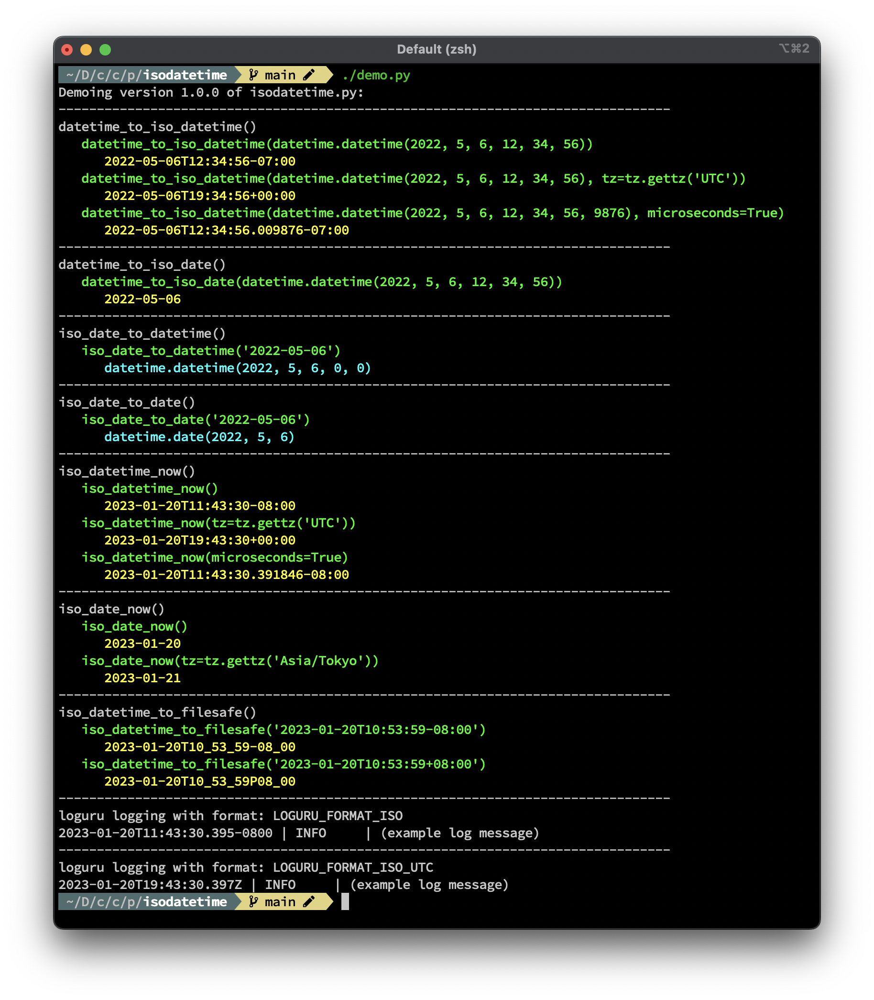

# isodatetime.py

A bunch of helper functions for working with iso dates / datetimes in Python.

At the moment there is no "packaging" release, but the module (`isodatetime.py`) is a single Python file with no external dependencies, so you can just copy/paste it into your own projects,

## Demo
You can demo the functionality by running `demo.py` (which _does_ have some external dependencies).

